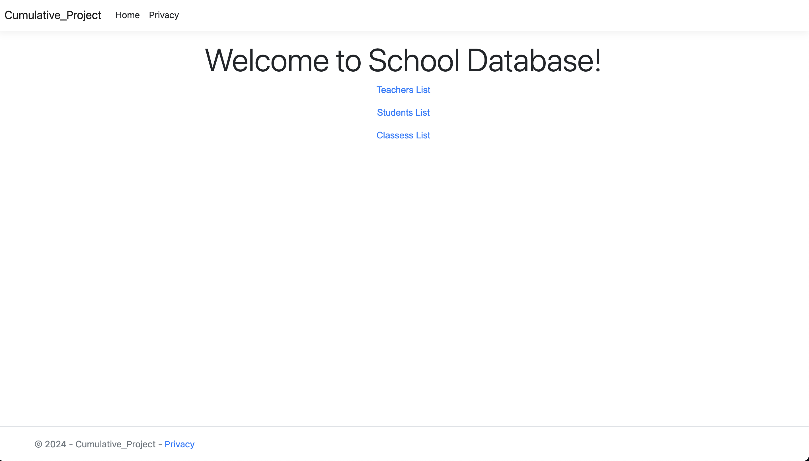
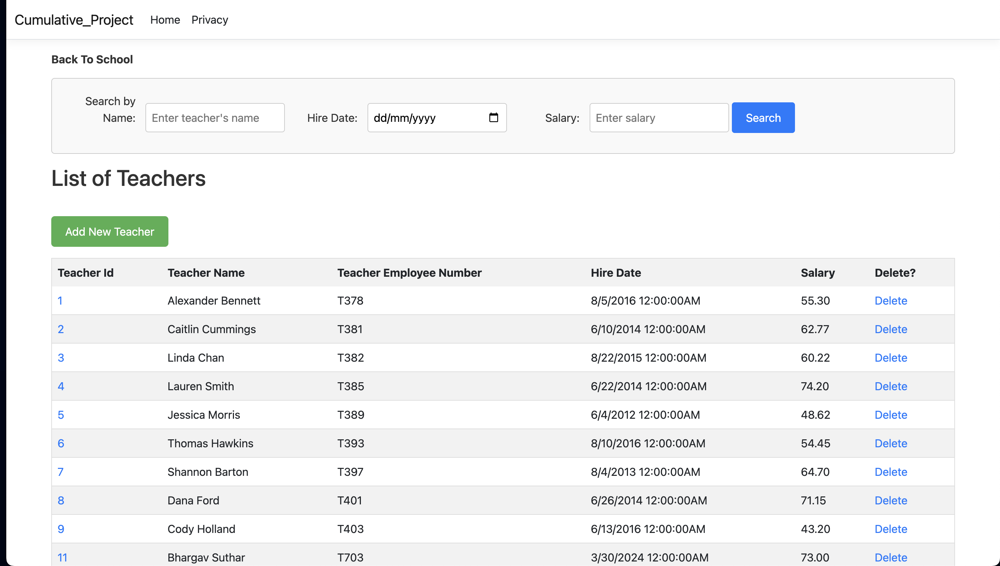
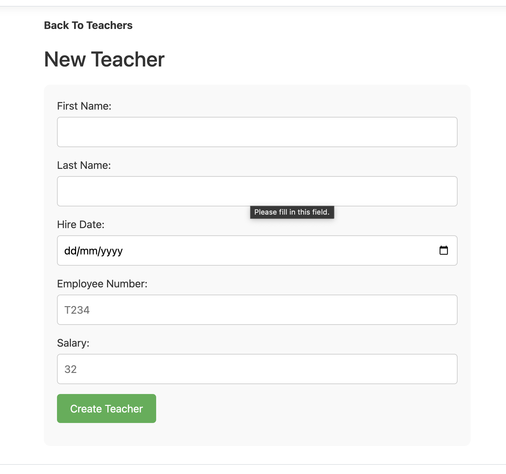
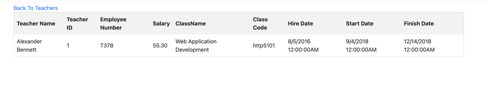
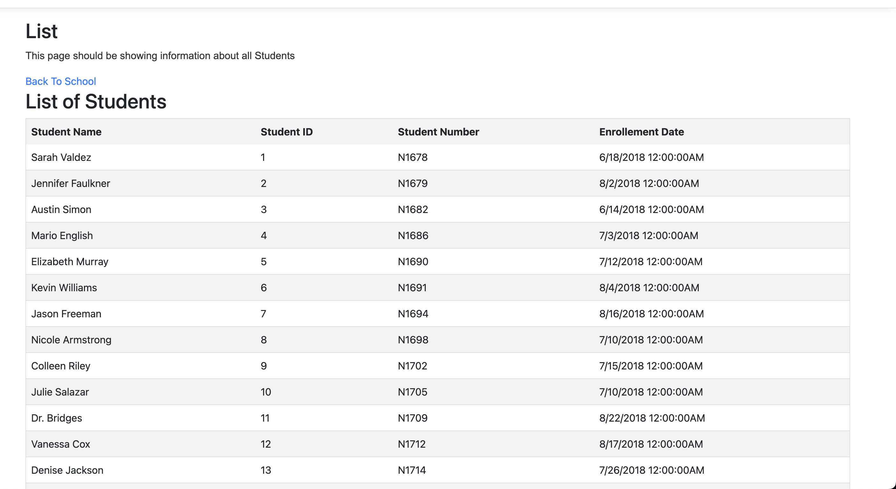
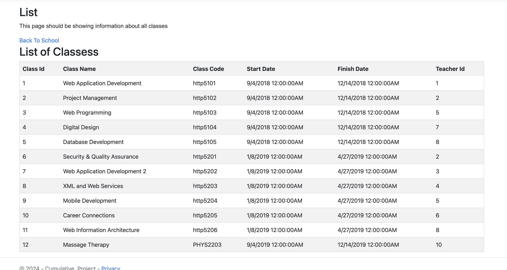

# CSharp_Cummulative2

# Future Features:

Attendance Tracking: Ability to mark and track student attendance for each class or session.

[WireFrame link](https://www.figma.com/file/f2Flb9tWcAWNEw5yV1KQUU/Cumulative-Project?type=design&node-id=0%3A1&mode=design&t=VilEuVbhfZIKjy0H-1)

# Home Page

# List Teacher Page

When the user, clicks on teacher's id, it will navigate to the Teachers More info. Page, in which, teacher have which subjects all listed there.

# New Teacher Creating Page

# Teacher Delete Confirm Page

# Teachers Classes Page

# Student

# Class

