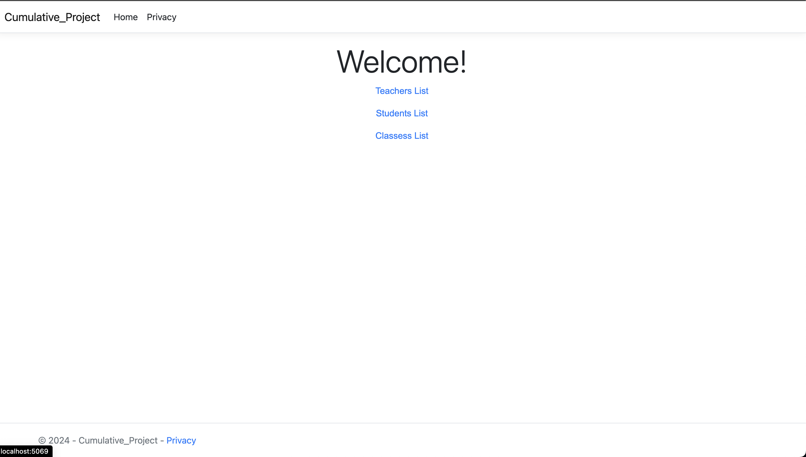
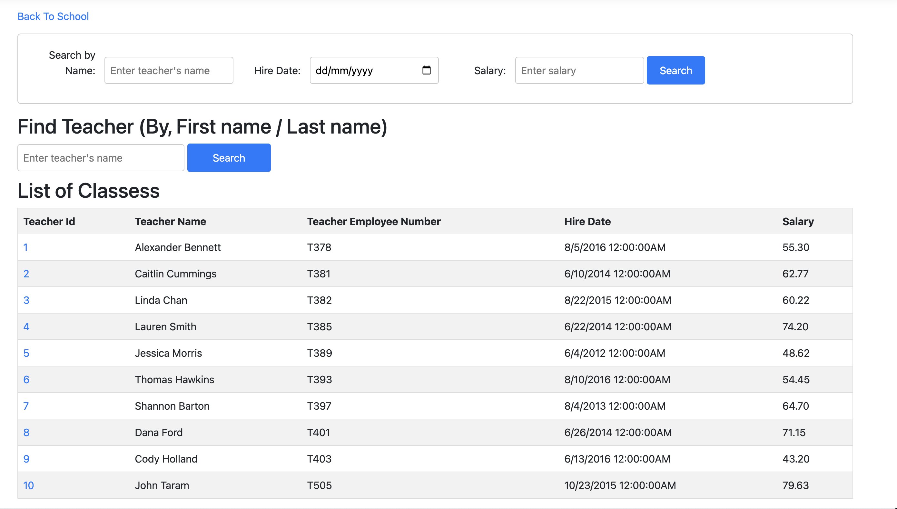

# CSharp_Cummulative1

# Home Page

# Teachers Page

When the user, clicks on teacher's id, it will navigate to the Teachers More info. Page, in which, teacher have which subjects all listed there.

# Teachers Classes Page

# Student

# Class

